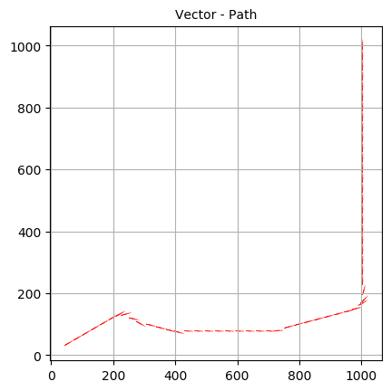

Authors
--

	Govind Ajith Kumar
	UID : 116699488
	Masters Robotics 
	University of Maryland
	College Park
	Maryland
	20740 USA

	Rajeshwar NS
	UID : 116921237
	Masters Robotics
	University of Maryland
	College Park
	Maryland
	20740 USA	
 
 
 
 
 
 
 
 
 
 
 
 

Language
--
	Python 3.7.x

THIS PROGRAMME TAKES THE USER INPUTS BELOW AND SOLVES THE OBSTACLE SPACE VERY QUICKLY
--

time taken (for A* solving) ~ <1 second
To solve the necessary test cases, please know that the start and the goal points here are adjusted based on the clearance and the width of the robot
This avoids the goal or the start getting into the borders or any obstacles
For the turtle bot, this value is fixed at 35
If you wish to change this value, please rerun the code after doing so.
ALSO !! NOTE !!, the coordinates of the obstacle points have been multiplied by a factor of 100

This ensures a clearer graph. Hence, please multiply by a factor of 100, before input. For example: 5.5 will be = 5.5*100 = 550
Range of x coordinates you can enter  =  0 - 1020
Range of y coordinates you can enter  =  0 - 1020
Please wait while the map is being generated. Approximate wait time < 5 seconds . 
Please wait while your solution is being calculated . 
Time taken on a high end Personal Computer ~ < 1 second
This will generate a map with solution, backtracked path, quiver plot and an animation too! 
## NOTE : Quiver plot will take an additional 10 minutes to calculate 
Libraries
--

	numpy :: for matrices and other associated numerical calculations
	copy :: to copy
	math :: for all mathematical operations
	heapq :: for priority queue
	time :: for measuring the time
	cv2 :: for image related operations (OpenCV 4.xx)
	pygame :: For animations
	matplotlib:: To plot the graphs and see the path taken by the robot from the start to the goal node and the quiver plots
## NOTE :::: PLEASE MAKE SURE THAT THE MATPLOTLIB GRAPHS CAN BE DISPLAYED, ESPECIALLY IF BEING RUN ON SPYDER or even any other IDE

Solves the obstacle map based on the A* Algorithm For Rigid Robot with a radius and clearance fro non- Holonomic Drive Robot

The following inputs are required by the user:

	Vector with x and y coordinate of the start and the initial orientation
	Vector with x and y coordinate of the goal
	Left Wheel RPM
	Right Wheel RPM
	Step Count
	Time you wish to choose to run the robot

Inputs
--

	Enter the  here, with a blank in between them (suggested : 10 10 30) : > 10 10 30
	Enter the x and y coordinate of the goal and the , in the form of blanks (suggested : 1010 1010) : > 1010 1010
	Enter the LEFT WHEEL RPM AND RIGHT WHEEL RPM  : > 3 8
	Enter the clearance of the robot with the nearby obstacles : (suggested value  < 5) : > 5
	Enter the step (1-10): (suggested values  = 1) : > 1
	Please enter the time you wish to choose to run the robot (suggested value = 1 second) : 1

Time for solution
--

approx 5 seconds for map generation 
1 second for solution 
2 seconds for visited and backtracked maps 
<10 seconds for quiver plot 

Inputs
--
	Enter the x and y coordinate of the start and the initial orientation here, with a blank in between them (suggested : 10 10 30) : > 10 10 30
	Enter the x and y coordinate of the goal and the , in the form of blanks (suggested : 1010 1010) : > 1010 1010
	Enter the LEFT WHEEL RPM AND RIGHT WHEEL RPM  : > 3 8
	Enter the clearance of the robot with the nearby obstacles : (suggested value  < 5) : > 5
	Enter the step (1-10): (suggested values  = 1) : > 1
	Wheel radius is calculated to be 76mm/2 -> approximating to 0.5
	Please enter the time you wish to choose to run the robot (siggested value = 1 second) : 1

Time for solution
--

approx 5 seconds for map generation 
1 second for solution 
2 seconds for visited and backtracked maps 
<10 seconds for quiver plot 

After Reaching the goal, the backtracking will commence.

	Once the backtracking is complete the following sets of outputs are given out:
	Image of the obstacles (OpenCV)
	Animation showing the visited nodes and the backtracked path (using pygame)
	Graph plot showing path of solution (MatplotLib)
	Image of the visited nodes (OpenCV)
	Image of backtracked path (OpenCV)
	Graph plot showing quiver plot(MatplotLib)

